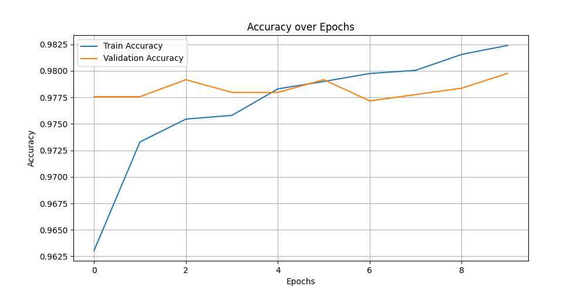
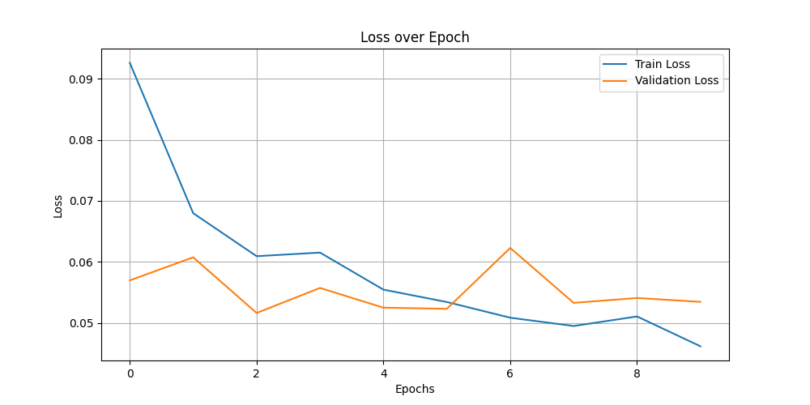

# Cats vs. Dogs Classification with Transfer Learning

This project focuses on building a machine learning model capable of classifying images as either a cat or a dog. By leveraging the power of **transfer learning** with the **MobileNetV2** architecture, we utilize pre-trained weights from the ImageNet dataset to simplify the training process and achieve high accuracy efficiently.

This project is both an educational resource for learners and a demonstration of practical skills for a portfolio. It showcases the fundamentals of working with image datasets, transfer learning, and training neural networks for binary classification tasks.

---

## 1. Introduction

### What is this project?

This project is a **binary image classification task** designed to distinguish between images of cats and dogs. By analyzing the visual features of input images, a machine learning model predicts whether an image contains a cat or a dog. This is achieved using transfer learning, where a pre-trained neural network, **MobileNetV2**, is fine-tuned to adapt to this specific task.

### Why is it important?

Binary classification is a foundational concept in Machine Learning, with applications spanning across many domains, such as:

- **Healthcare**: Identifying the presence or absence of diseases in medical images.
- **Security**: Recognizing authorized personnel through facial recognition.
- **Retail**: Classifying products into predefined categories for better organization and recommendation systems.

In addition, this project highlights the power of transfer learning, allowing us to leverage pre-trained models to:

- Reduce computational requirements and training time.
- Achieve higher accuracy with smaller datasets.
- Enable practical applications of Machine Learning, even with limited resources.

The Cats vs. Dogs dataset serves as an accessible and popular benchmark, making this project an excellent case study for anyone starting with computer vision and classification tasks.

### Target Audience

This project is designed for:

- **Learners in Machine Learning**: It provides a hands-on experience with computer vision tasks, dataset preparation, and transfer learning techniques.
- **Portfolio Development**: The modular structure and clear documentation make it an ideal addition to a professional portfolio, demonstrating skills in:
  - Handling image datasets.
  - Building and training ML models.
  - Visualizing results and interpreting performance metrics.

---

## 2. Dataset

The dataset used in this project is the [Kaggle Cats and Dogs Dataset](https://www.microsoft.com/en-us/download/details.aspx?id=54765), which contains over 25,000 images of cats and dogs. These images are divided into two primary classes:

- Cat
- Dog

The dataset is stored in a structured directory format:

```plaintext
data/
├── Cat/
│   ├── cat.1.jpg
│   ├── cat.2.jpg
│   └── ...
├── Dog/
│   ├── dog.1.jpg
│   ├── dog.2.jpg
│   └── ...
```

Each class contains thousands of images, providing sufficient data for training and validation. However, the raw dataset includes some corrupted or invalid files that need to be handled during preprocessing.

### Data Preparation

To prepare the dataset for training, the following preprocessing steps were implemented:

1. **Cleaning Invalid Images**:
    - The dataset is scanned for corrupted or non-image files using the `Pillow` library. Any invalid files are automatically removed to avoid runtime errors during training.
2. **Resizing**:
   - All images are resized to **224x224** pixels, matching the input size expected by the MobileNetV2 model. This ensures uniformity in data dimensions.
3. **Normalization**:
   - Pixel values are scaled to the range **[0, 1]** to standardize the data and improve model convergence during training.
4. **Data Augmentation**:
   - Augmentation techniques, such as **random rotations**, **horizontal flips**, and **zooming**, are applied to the training data. This increases data variability, helping the model generalize better and reducing overfitting.
5. **Train-Validation Split**:
   - The dataset is split into:
     - 80% for **training**
     - 20% for **validation**
This ensures that the model is evaluated on unseen data during training, providing a measure of its generalization performance.

### Challenges

1. **Invalid or Corrupted Files**:
   - Raw datasets often include files that are unreadable or not valid images. These need to be identified and removed to prevent interruptions during model training.
2. **Class Imbalance**:
   - Although this dataset is relatively balanced between cats and dogs, many real-world datasets suffer from significant imbalances, which can bias the model. Careful monitoring of metrics during training is necessary to detect and address this issue.
3. **Dataset Size**:
   - While this dataset contains a substantial number of images, it's small compared to industrial-scale datasets. Transfer learning compensates for this limitation by utilizing pre-trained weights.

By implementing these preparation steps, the dataset becomes clean, consistent, and ready for use in training the classification model.

---

## 3. Model Architecture

### What is Transfer Learning?

**Transfer learning** is a technique in Machine Learning where a model pre-trained on a large dataset is adapted for a new, smaller dataset. Instead of training a model from scratch, we use the knowledge the pre-trained model has already learned and fine-tune it for the specific task.

In this project, we use the **MobileNetV2** architecture, pre-trained on the ImageNet dataset, which contains over 1 million images across 1,000 classes. MobileNetV2 provides a robust feature extractor for our binary classification task (cats vs. dogs) without needing a massive dataset or long training times.

### Why MobileNetV2?

MobileNetV2 is an efficient and lightweight neural network designed for mobile and embedded vision applications. It is ideal for this project because:

- **Compact Size**: MobileNetV2 is small in memory and computational requirements, making it easy to run even on devices with limited resources.
- **Pre-trained Weights**: Leverages knowledge from ImageNet, allowing quick adaptation to our classification task.
- **Speed and Accuracy**: Balances speed and performance, achieving high accuracy with minimal computational cost.
- **Scalability**: Can be further tuned for larger or smaller resource constraints.

These characteristics make MobileNetV2 a practical choice for building a robust image classifier in this project.

### Custom Layers

To adapt the pre-trained MobileNetV2 model for the cats vs. dogs classification task, we add a series of custom layers on top of the base model:

1. **Base Model (MobileNetV2)**:
   - Acts as a feature extractor, providing a rich representation of the input images.
   - Includes all convolutional layers up to the "top" layer, which is excluded to allow customization.
2. **GlobalAveragePooling2D**:
   - Converts the 3D feature maps from the base model into a single 2D feature vector by averaging across spatial dimensions.
   - Reduces the number of parameters and helps prevent overfitting.
3. **Dense Layer (128 neurons)**:
   - Fully connected layer with 128 neurons and ReLU activation.
   - Extracts more abstract features and learns task-specific patterns.
4. **Dropout (Rate = 0.5)**:
   - Randomly deactivates 50% of the neurons during training to reduce overfitting and improve generalization.
5. **Output Layer (Dense with Sigmoid Activation)**:
   - A single neuron with a sigmoid activation function outputs a probability:
     - Close to 0 for cats.
     - Close to 1 for dogs.

### Summary of the Model Architecture

- **Pre-trained Base**: MobileNetV2 with frozen weights for efficient feature extraction.
- **Custom Layers**: Global pooling, dense layers, dropout, and a binary output layer for classification.
- **Compiled Model**:
  - **Optimizer**: Adam (adaptive learning rate for stable convergence).
  - **Loss**: Binary Crossentropy (suitable for binary classification).
  - **Metrics**: Accuracy (measures the model's performance).

This architecture balances efficiency and accuracy, leveraging transfer learning to achieve high performance on a relatively small dataset.

---

## 4. Training the Model

### Steps in Training

The training process involves several key steps to ensure the model learns effectively and generalizes well to unseen data:

1. **Data Splitting**:
   - The dataset is divided into **80% for training** and **20% for validation** using the `ImageDataGenerator` class.
   - The training set is used to update the model weights, while the validation set evaluates performance after each epoch to check how well the model generalizes.
2. **Data Augmentation**:
   - Data augmentation techniques are applied to the training set to increase variability and reduce overfitting:
     - **Random Rotations**: Rotates images randomly up to 20 degrees.
     - **Horizontal Flips**: Flips images horizontally to simulate different perspectives.
     - *Zooming*: Randomly zooms into images by up to 20%.
   - These transformations create new, diverse examples, improving the model's robustness to variations.
3. **Batch Processing**:
   - The data is processed in batches of 32 images, allowing efficient memory usage and parallel computations.

### Callbacks

**Callbacks** are utilities that allow custom actions during training. In this project, we use the `ModelCheckpoint` callback to save the best version of the model based on validation accuracy:

- **`ModelCheckpoint` Configuration**:
  - **Filepath**: Saves the best model to `models/saved_model.keras`.
  - **Monitor**: Tracks the validation accuracy metric to determine the best model.
  - **Save Best Only**: Ensures only the model with the highest validation accuracy is saved, preventing unnecessary overwrites.

This approach ensures that the best-performing model during training is available for evaluation and deployment.

### Evaluation

The model is evaluated using the following metrics:

1. **Accuracy**:
   - Measures the proportion of correct predictions over the total number of predictions.
   - Reported for both the training and validation datasets after each epoch to monitor learning progress.
2. **Loss**:
   - Represents the error between the model's predictions and the actual labels.
   - The Binary Crossentropy loss function is used, suitable for binary classification tasks.
   - Lower loss indicates better alignment between predictions and true labels.

### Training Workflow

1. The training data is fed into the model in batches of 32 images.
2. For each epoch:
   - The model updates its weights based on the training data (backpropagation).
   - Validation performance is computed using the unseen validation data.
   - If validation accuracy improves, the best model is saved using the `ModelCheckpoint`.

This structured training process ensures that the model learns effectively from the data, generalizes well to new examples, and avoids overfitting.

---

## 5.  Results

### Performance Metrics

The model achieved the following performance metrics after training for 10 epochs:

- **Training Accuracy**: ~98.2%
- **Validation Accuracy**: ~97.9%
- **Training Loss**: ~0.045
- **Validation Loss**: ~0.053

These metrics indicate that the model performs well in distinguishing between cats and dogs, with high accuracy and low loss for both training and validation datasets.

### Visualization

#### 1. Accuracy Graph

- **Description**: Displays the accuracy for both training and validation datasets over 10 epochs.
- **Key Observations**:
  - The accuracy improves steadily over the epochs, reaching a plateau around 97-98%.
  - The training and validation accuracy curves are close, indicating good generalization.



#### 2.Loss Graph

- **Description**: Shows the binary crossentropy loss for training and validation datasets over 10 epochs.
- **Key Observations**:
  - The training loss decreases consistently, indicating the model is learning effectively.
  - The validation loss fluctuates slightly but remains close to the training loss, suggesting minimal overfitting.



### Key Takeaways

1. **Successes**:
   - **High Accuracy**: The model achieved excellent performance on both training and validation datasets, demonstrating the effectiveness of transfer learning with MobileNetV2.
   - **Generalization**: The close alignment of training and validation metrics suggests that the model generalizes well to unseen data.
2. **Limitations**:
   - **Potential Overfitting**: While overfitting is minimal, the slight fluctuation in validation loss suggests that additional regularization (e.g., more dropout) or early stopping could be explored.
   - **Dataset Scope**: The model is trained on a specific dataset (cats vs. dogs) and may not generalize to other animal categories or images with challenging conditions (e.g., low lighting or occlusions).
3. **Future Improvements**:
   - Fine-tuning the pre-trained MobileNetV2 layers could further improve performance.
   - Experimenting with additional augmentations or a larger dataset could enhance the model's robustness.

---

## 6. Project Structure

The project is organized into a modular and reusable codebase, with each folder serving a specific purpose. This structure allows for scalability and easy maintenance.

### Folder Structure

```plaintext
cats_vs_dogs_tl/
├── models/
│   ├── model.py
├── src/
|   ├── img/
│   |    ├── accuracy_plot.png
│   |    ├── loss_plot.png
|   ├── models/
│   |    ├── saved_model.keras
│   |    ├── final_model.keras
│   ├── load_data.py
│   ├── train_model.py
|   ├── output_images.png
├── data/
│   ├── Cat/
│   ├── Dog/
├── requirements.txt
├── README.md
└── .gitignore
```

### Explanation of Each Folder/File

1. **`models/`**:
   - Contains the model definition.
     - `model.py`: Defines the transfer learning architecture with MobileNetV2 and custom layers for binary classification.
2. **`src/`**:
   - Core scripts for data preparation, training, and evaluation.
     - `load_data.py`: Prepares the dataset by:
       - Cleaning invalid images.
       - Resizing and normalizing image data.
       - Augmenting the training data for better generalization.
       - Splitting data into training and validation sets.
       - Visualizing the dataset.
     - `train_model.py`: Handles the model training process, including:
       - Configuring callbacks to save the best model.
       - Plotting training and validation metrics (accuracy and loss).
       - Saving performance graphs for analysis.
     - `img/`: Stores generated graphs for visualizing model performance.
       - `accuracy_plot.png`: Graph of training and validation accuracy over epochs.
       - `loss_plot.png`: Graph of training and validation loss over epochs.
     - `models`: Stores saved models from training.
       - `saved_model.keras`: The best model saved during training based on validation accuracy.
       - `final_model.keras`: The final model saved after completing all epochs of training.
3. **`data/`**:
   - Contains the dataset used for training and validation.
     - Organized into `Cat/` and `Dog/` subfolders for respective classes.
4. **Root Files**:
   - `requirements.txt`: Lists all required Python libraries for the project, enabling easy environment setup.
   - `README.md`: Documentation explaining the project goals, methodology, and results.
   - `.gitignore`: Excludes unnecessary files (e.g., large datasets and virtual environment files) from version control.

### Modularity and Reusability

- **Modular Design**: Each script is self-contained, focusing on a specific task:
  - `load_data.py` for data handling.
  - `model.py` for architecture definition.
  - `train_model.py` for training and evaluation.
- **Reusability**:
  - The model architecture can be easily adapted for other classification tasks by changing the dataset and output layers.
  - The data preprocessing and training workflows are flexible and can accommodate new datasets with minimal changes.
- **Scalability**: The structure supports adding additional scripts (e.g., for testing or deployment) without disrupting existing functionality.

---

## 7. How to Run the Project

This section provides a detailed guide to setting up and running the Cats vs. Dogs Classification project. Follow these steps to replicate the training process and generate results.

### Prerequisites

Ensure you have the following software and libraries installed:

- **Python 3.10 or later**: The project relies on modern Python features and libraries.
- **Libraries** (specified in `requirements.txt`):
  - TensorFlow (CPU or GPU version)
  - Pillow (for image handling)
  - Matplotlib (for plotting)
  - Other dependencies (see `requirements.txt` for the full list).

To install all dependencies, use:

```bash
pip install -r requirements.txt
```

- **Hardware**:
  - A machine with a CPU or GPU. Training on a GPU significantly reduces runtime but is not mandatory.

### Step-by-Step Guide

1. **Clone the Repository**:

Clone the project from GitHub:

```bash
git clone https://github.com/jampamatos/cats_vs_dogs_tl.git
cd cats_vs_dogs_tl
```

2. **Set Up a Virtual Environment**:

Create and activate a Python virtual environment (optional but recommended):

```bash
python -m venv venv
source venv/bin/activate  # For Linux/Mac
venv\Scripts\activate     # For Windows
```

3. **Install Dependencies**:

Install all required Python libraries:

```bash
pip install -r requirements.txt
```

4. **Download and Prepare the Dataset**:

- Download the Microsoft Cats vs. Dogs Dataset from [this link](https://www.microsoft.com/en-us/download/details.aspx?id=54765).
- Extract the dataset and place it in the data/ directory within the project folder:

```plaintext
cats_vs_dogs_tl/
└── data/
    ├── Cat/
    ├── Dog/
```

5. **Run the Training Script**:

Start the training process by running:

```bash
python src/train_model.py
```

The script will:

- Clean any invalid images from the dataset.
- Split the data into training and validation sets.
- Train the model for 10 epochs (default).
- Save the best-performing model as `src/models/saved_model.keras` and the final model as `src/models/final_model.keras`.
- Generate accuracy and loss graphs saved in the `src/img/` folder.

### Expected Output

After successfully running the training script, you should see:

1. **Saved Models**:
   - `src/models/saved_model.keras`: The model with the highest validation accuracy.
   - `src/models/final_model.keras`: The model after the final training epoch.
2. **Performance Graphs**:
   - `src/img/accuracy_plot.png`: Shows training and validation accuracy over epochs.
   - `src/img/loss_plot.png`: Displays training and validation loss over epochs.
3. **Console Logs**:
   - A detailed log of the training process, including epoch-by-epoch accuracy and loss for both training and validation datasets.
   - Example:
        ```plaintext
        Epoch 1/10
        625/625 [==============================] - 1109s 2s/step - accuracy: 0.9449 - loss: 0.1310 - val_accuracy: 0.9776 - val_loss: 0.0570
        ```

4. **Training Duration**:
   - Training on a CPU for 10 epochs takes approximately 3 hours. On a GPU, the process is significantly faster (around 30 minutes).

---

## 8. What You Will Learn

This project provides an excellent opportunity for learners to gain practical experience in key areas of Machine Learning, particularly in computer vision. By studying and replicating this project, you will gain the following skills:

### 1. Working with Image Datasets

- **Dataset Handling**:
  - Learn how to work with real-world image datasets, including directory organization and file management.
  - Understand common challenges like invalid files and how to clean and preprocess the data effectively.
- **Data Augmentation**:
  - Use techniques such as rotation, flipping, and zooming to create a more diverse dataset, improving model generalization.

### 2. Transfer Learning Concepts

- **Pre-trained Models**:
  - Discover how to leverage the power of pre-trained models like MobileNetV2 for efficient feature extraction.
- **Fine-Tuning**:
  - Understand when and how to freeze or unfreeze layers in a pre-trained model to adapt it to a specific task.

### 3. Training and Evaluating Models

- **Training Process**:
  - Follow a step-by-step process to train a deep learning model for a binary classification task.
- **Metrics**:
  - Learn to evaluate model performance using accuracy and loss metrics on both training and validation data.
- **Saving and Loading Models**:
  - Understand the importance of saving the best-performing model during training for deployment or further fine-tuning.

### 4. Modular Code Organization for ML Projects

- **Scalable Codebase**:
  - Observe and replicate a clean, modular project structure, separating data handling, model definition, and training logic.
- **Reusability**:
  - Learn how to write reusable components, such as modular scripts for loading data, defining models, and training processes, which can be adapted to other projects.

By completing this project, you will not only develop a strong understanding of these fundamental concepts but also build a portfolio piece that demonstrates your ability to apply machine learning techniques to solve real-world problems. This combination of skills is essential for aspiring ML practitioners.

---

## 9. Credits

This project is part of a **Project Challenge** for the **Digital Innovation One (DiO)** and **BairesDev** bootcamp, "Machine Learning Practitioner". The challenge provides a hands-on opportunity to apply machine learning concepts learned during the bootcamp.

We also acknowledge:

- **Microsoft** for the **Cats vs. Dogs Dataset**, a widely used benchmark for binary image classification tasks.
- The creators of **MobileNetV2**, whose architecture enables lightweight and efficient neural networks, making transfer learning accessible.

These resources and inspirations have been invaluable in building this project.

---

## 10. License

This project is licensed under the MIT License, which allows for open collaboration and reuse. For more details, refer to the [LICENSE file](LICENSE.md) in the repository.

---

## 11. Translations

A Portuguese version of this README is available for native Portuguese speakers.
[Clique aqui](pt_README.md) para a versão em português do README.

---

## 12. Contact

For feedback, questions, or suggestions, feel free to reach out:

- GitHub: [github.com/jampamatos](https://github.com/jampamatos)
- Email: [jp.coutm@gmail.com](maito:jp.coutm@gmail.com)

We welcome contributions and improvements to this project! Your feedback is highly appreciated!
