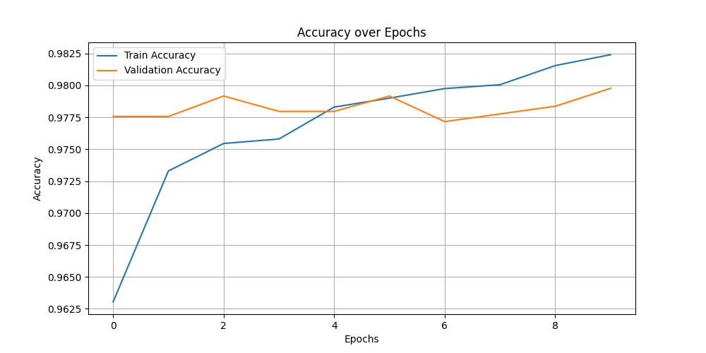
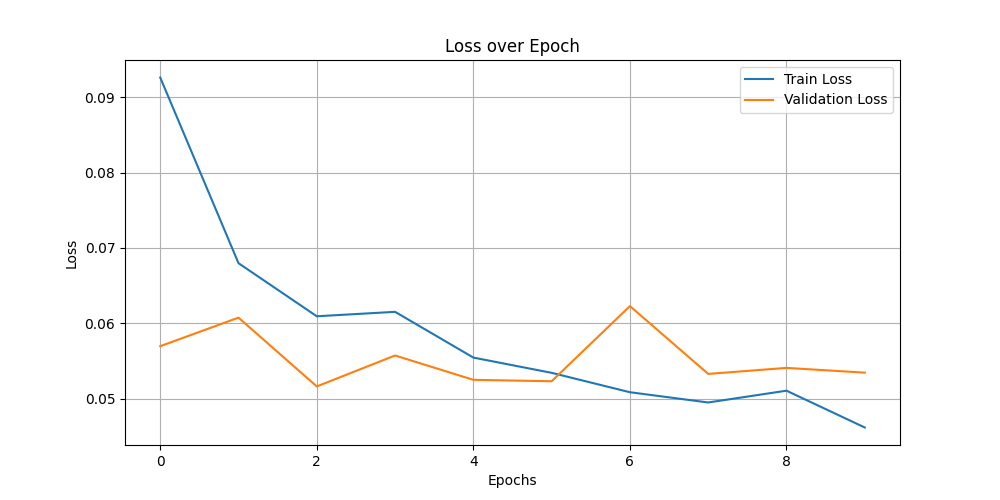

# Classificação de Gatos vs. Cachorros com Transfer Learning

Este projeto tem como objetivo construir um modelo de aprendizado de máquina capaz de classificar imagens como sendo de um gato ou de um cachorro. Ao aproveitar o poder do **transfer learning** com a arquitetura **MobileNetV2**, utilizamos pesos pré-treinados do dataset ImageNet para simplificar o processo de treinamento e alcançar alta precisão de forma eficiente.

Este projeto é tanto um recurso educacional para aprendizes quanto uma demonstração de habilidades práticas para um portfólio. Ele aborda os fundamentos de trabalho com datasets de imagens, transfer learning e treinamento de redes neurais para tarefas de classificação binária.

---

## 1. Introdução

### O que é este projeto?

Este projeto é uma **tarefa de classificação binária de imagens** projetada para distinguir entre imagens de gatos e cachorros. Ao analisar as características visuais das imagens de entrada, um modelo de aprendizado de máquina prevê se uma imagem contém um gato ou um cachorro. Isso é alcançado utilizando transfer learning, onde uma rede neural pré-treinada, **MobileNetV2**, é ajustada para se adaptar a essa tarefa específica.

### Por que isso é importante?

Classificação binária é um conceito fundamental no aprendizado de máquina, com aplicações que abrangem diversos domínios, como:

- **Saúde**: Identificar a presença ou ausência de doenças em imagens médicas.
- **Segurança**: Reconhecer pessoas autorizadas por meio de reconhecimento facial.
- **Varejo**: Classificar produtos em categorias predefinidas para melhor organização e sistemas de recomendação.

Além disso, este projeto destaca o poder do transfer learning, permitindo aproveitar modelos pré-treinados para:

- Reduzir os requisitos computacionais e o tempo de treinamento.
- Alcançar maior precisão com conjuntos de dados menores.
- Habilitar aplicações práticas de aprendizado de máquina, mesmo com recursos limitados.

O dataset Cats vs. Dogs serve como um benchmark acessível e popular, tornando este projeto um excelente estudo de caso para quem está começando com visão computacional e tarefas de classificação.

### Público-alvo

Este projeto é projetado para:

- **Aprendizes de Machine Learning**: Proporciona uma experiência prática com tarefas de visão computacional, preparação de datasets e técnicas de transfer learning.
- **Desenvolvimento de Portfólio**: A estrutura modular e a documentação clara o tornam uma adição ideal para um portfólio profissional, demonstrando habilidades em:
  - Manipulação de datasets de imagens.
  - Construção e treinamento de modelos de aprendizado de máquina.
  - Visualização de resultados e interpretação de métricas de desempenho.

---

## 2. Dataset

O dataset utilizado neste projeto é o [Kaggle Cats and Dogs Dataset](https://www.microsoft.com/en-us/download/details.aspx?id=54765), que contém mais de 25.000 imagens de gatos e cachorros. Essas imagens são divididas em duas classes principais:

- Gato
- Cachorro

O dataset é armazenado em um formato de diretório estruturado:

```plaintext
data/
├── Cat/
│   ├── cat.1.jpg
│   ├── cat.2.jpg
│   └── ...
├── Dog/
│   ├── dog.1.jpg
│   ├── dog.2.jpg
│   └── ...
```

Cada classe contém milhares de imagens, proporcionando dados suficientes para treinamento e validação. No entanto, o dataset bruto inclui alguns arquivos corrompidos ou inválidos que precisam ser tratados durante o pré-processamento.

### Preparação do Dataset

Para preparar o dataset para treinamento, as seguintes etapas de pré-processamento foram implementadas:

1. **Limpeza de Imagens Inválidas**:
    - O dataset é verificado em busca de arquivos corrompidos ou que não sejam imagens utilizando a biblioteca `Pillow`. Qualquer arquivo inválido é automaticamente removido para evitar erros durante o treinamento.
2. **Redimensionamento**:
   - Todas as imagens são redimensionadas para **224x224** pixels, correspondendo ao tamanho de entrada esperado pelo modelo MobileNetV2. Isso garante uniformidade nas dimensões dos dados.
3. **Normalização**:
   - Os valores dos pixels são escalados para o intervalo **[0, 1]**, padronizando os dados e melhorando a convergência do modelo durante o treinamento.
4. **Aumento de Dados (Data Augmentation)**:
   - Técnicas de aumento de dados, como **rotações aleatórias**, **espelhamento horizontal** e **zoom**, são aplicadas aos dados de treinamento. Isso aumenta a variabilidade dos dados, ajudando o modelo a generalizar melhor e reduzindo o overfitting.
5. **Divisão Treinamento-Validação**:
   - O dataset é dividido em:
     - 80% para **treinamento**
     - 20% para **validação**
Essa divisão garante que o modelo seja avaliado em dados não vistos durante o treinamento, proporcionando uma medida de sua capacidade de generalização.

### Desafios

1. **Arquivos Corrompidos ou Inválidos**:
   - Datasets brutos frequentemente incluem arquivos ilegíveis ou que não são imagens válidas. Esses arquivos precisam ser identificados e removidos para evitar interrupções durante o treinamento do modelo.
2. **Desequilíbrio de Classes**:
   - Embora este dataset seja relativamente equilibrado entre gatos e cachorros, muitos datasets reais sofrem com desequilíbrios significativos, o que pode enviesar o modelo. O monitoramento cuidadoso das métricas durante o treinamento é necessário para detectar e corrigir esse problema.
3. **Tamanho do Dataset**:
   - Embora este dataset contenha um número substancial de imagens, ele é pequeno em comparação com datasets em escala industrial. O transfer learning compensa essa limitação utilizando pesos pré-treinados.

Ao implementar essas etapas de preparação, o dataset torna-se limpo, consistente e pronto para uso no treinamento do modelo de classificação.

---

## 3. Arquitetura do Modelo

### O que é Transfer Learning?

**Transfer learning** é uma técnica de aprendizado de máquina onde um modelo pré-treinado em um grande dataset é adaptado para um novo e menor dataset. Em vez de treinar um modelo do zero, utilizamos o conhecimento que o modelo pré-treinado já adquiriu, ajustando-o para a tarefa específica.

Neste projeto, utilizamos a arquitetura **MobileNetV2**, pré-treinada no dataset **ImageNet**, que contém mais de 1 milhão de imagens distribuídas em 1.000 classes. O MobileNetV2 fornece um extrator de características robusto para nossa tarefa de classificação binária (gatos vs. cachorros), sem a necessidade de um grande dataset ou longos tempos de treinamento.

### Por que MobileNetV2?

O MobileNetV2 é uma rede neural eficiente e leve, projetada para aplicações de visão em dispositivos móveis e embarcados. Ele é ideal para este projeto porque:

- **Tamanho Compacto**: MobileNetV2 tem baixa exigência de memória e recursos computacionais, permitindo sua execução em dispositivos com recursos limitados.
- **Pesos Pré-treinados**: Aproveita o conhecimento do ImageNet, permitindo uma rápida adaptação à nossa tarefa de classificação.
- **Velocidade e Precisão**: Equilibra rapidez e desempenho, alcançando alta precisão com custo computacional mínimo.
- **Escalabilidade**: Pode ser ajustado para restrições de recursos maiores ou menores.

Essas características tornam o MobileNetV2 uma escolha prática para construir um classificador de imagens robusto neste projeto.

### Camadas Personalizadas

Para adaptar o modelo pré-treinado MobileNetV2 à tarefa de classificação de gatos vs. cachorros, adicionamos uma série de camadas personalizadas sobre o modelo base:

1. **Modelo Base (MobileNetV2)**:
   - Atua como um extrator de características, fornecendo uma representação rica das imagens de entrada.
   - Inclui todas as camadas convolucionais até a camada "top", que é excluída para permitir personalizações.
2. **GlobalAveragePooling2D**:
   - Converte os mapas de características 3D do modelo base em um único vetor 2D, realizando a média das dimensões espaciais.
   - Reduz o número de parâmetros e ajuda a evitar overfitting.
3. **Camada Densa (128 neurônios)**:
   - Camada totalmente conectada com 128 neurônios e ativação ReLU.
   - Extrai características mais abstratas e aprende padrões específicos da tarefa.
4. **Dropout (Taxa = 0.5)**:
   - Desativa aleatoriamente 50% dos neurônios durante o treinamento, reduzindo o overfitting e melhorando a generalização.
5. **Camada de Saída (Densa com Ativação Sigmoid)**:
   - Um único neurônio com ativação sigmoid que produz uma probabilidade:
     - Próxima de 0 para gatos.
     - Próxima de 1 para cachorros.

### Resumo da Arquitetura do Modelo

- **Base Pré-treinada**: MobileNetV2 com pesos congelados para extração eficiente de características.
- **Camadas Personalizadas**: Pooling global, camadas densas, dropout e uma camada de saída binária para classificação.
- **Modelo Compilado**:
  - **Otimizador**: Adam (taxa de aprendizado adaptativa para convergência estável).
  - **Perda**: Binary Crossentropy (adequado para classificação binária).
  - **Métricas**: Acurácia (mede o desempenho do modelo).

Essa arquitetura equilibra eficiência e precisão, aproveitando o transfer learning para alcançar alto desempenho em um dataset relativamente pequeno.

---

## 4. Treinamento do Modelo

### Etapas do Treinamento

O processo de treinamento envolve várias etapas essenciais para garantir que o modelo aprenda de forma eficaz e generalize bem para dados não vistos:

1. **Divisão dos Dados**:
   - O dataset é dividido em **80% para treinamento** e **20% para validação** utilizando a classe `ImageDataGenerator`.
   - O conjunto de treinamento é usado para atualizar os pesos do modelo, enquanto o conjunto de validação avalia o desempenho após cada época, verificando como o modelo generaliza.
2. **Aumento de Dados**:
   - Técnicas de aumento de dados são aplicadas ao conjunto de treinamento para aumentar a variabilidade e reduzir o overfitting:
     - **Rotações Aleatórias**: Rotaciona imagens aleatoriamente em até 20 graus.
     - **Espelhamento Horizontal**: Espelha imagens horizontalmente para simular diferentes perspectivas.
     - **Zoom**: Realiza zoom aleatório nas imagens em até 20%.
   - Essas transformações criam novos exemplos diversos, melhorando a robustez do modelo frente a variações.
3. **Processamento em Lotes**:
   - Os dados são processados em lotes de 32 imagens, permitindo o uso eficiente da memória e cálculos paralelos.

### Callbacks

**Callbacks** são utilitários que permitem ações personalizadas durante o treinamento. Neste projeto, utilizamos o callback `ModelCheckpoint` para salvar a melhor versão do modelo com base na acurácia de validação:

- **Configuração do `ModelCheckpoint`**:
  - **Filepath**: Salva o melhor modelo no caminho `models/saved_model.keras`.
  - **Monitoramento**: Acompanha a métrica de acurácia de validação para determinar o melhor modelo.
  - **Salvar Apenas o Melhor**: Garante que apenas o modelo com a melhor acurácia de validação seja salvo, evitando sobregravações desnecessárias.

Essa abordagem garante que o modelo com melhor desempenho durante o treinamento esteja disponível para avaliação e implantação.

### Avaliação

O modelo é avaliado usando as seguintes métricas:

1. **Acurácia**:
   - Mede a proporção de previsões corretas em relação ao total de previsões.
   - É reportada para os conjuntos de treinamento e validação após cada época para monitorar o progresso do aprendizado.
2. **Perda (Loss)**:
   - Representa o erro entre as previsões do modelo e os rótulos reais.
   - A função de perda Binary Crossentropy é usada, adequada para tarefas de classificação binária.
   - Perdas mais baixas indicam melhor alinhamento entre as previsões e os rótulos verdadeiros.

### Fluxo de Trabalho do Treinamento

1. Os dados de treinamento são alimentados no modelo em lotes de 32 imagens.
2. Para cada época:
   - O modelo atualiza seus pesos com base nos dados de treinamento (backpropagation).
   - O desempenho de validação é calculado usando os dados de validação não vistos.
   - Se a acurácia de validação melhorar, o melhor modelo é salvo usando o `ModelCheckpoint`.

Esse processo estruturado de treinamento garante que o modelo aprenda de forma eficaz a partir dos dados, generalize bem para novos exemplos e evite overfitting.

---

## 5. Resultados

### Métricas de Desempenho

O modelo alcançou as seguintes métricas de desempenho após treinar por 10 épocas:

- **Acurácia no Treinamento**: ~98,2%
- **Acurácia na Validação**: ~97,9%
- **Perda no Treinamento**: ~0,045
- **Perda na Validação**: ~0,053

Essas métricas indicam que o modelo teve um bom desempenho na distinção entre gatos e cachorros, com alta acurácia e baixa perda tanto nos conjuntos de treinamento quanto de validação.

### Visualização

#### 1. Gráfico de Acurácia

- **Descrição**: Exibe a acurácia para os conjuntos de treinamento e validação ao longo de 10 épocas.
- **Principais Observações**:
  - A acurácia melhora de forma consistente ao longo das épocas, atingindo um platô em torno de 97-98%.
  - As curvas de acurácia de treinamento e validação estão próximas, indicando uma boa generalização.



#### 2. Gráfico de Perda

- **Descrição**: Mostra a perda de entropia cruzada binária para os conjuntos de treinamento e validação ao longo de 10 épocas.
- **Principais Observações**:
  - A perda no treinamento diminui consistentemente, indicando que o modelo está aprendendo de forma eficaz.
  - A perda na validação flutua levemente, mas permanece próxima à perda no treinamento, sugerindo overfitting mínimo.



### Principais Conclusões

1. **Sucessos**:
   - **Alta Acurácia**: O modelo alcançou um excelente desempenho nos conjuntos de treinamento e validação, demonstrando a eficácia do aprendizado por transferência com o MobileNetV2.
   - **Generalização**: A proximidade das métricas de treinamento e validação sugere que o modelo generaliza bem para dados não vistos.
2. **Limitações**:
   - **Possível Overfitting**: Embora o overfitting seja mínimo, a leve flutuação na perda de validação sugere que maior regularização (por exemplo, mais dropout) ou early stopping poderiam ser explorados.
   - **Escopo do Dataset**: O modelo foi treinado em um dataset específico (gatos vs. cachorros) e pode não generalizar para outras categorias de animais ou imagens em condições desafiadoras (por exemplo, baixa iluminação ou obstruções).
3. **Melhorias Futuras**:
   - Ajustar os pesos do MobileNetV2 pré-treinado poderia melhorar ainda mais o desempenho.
   - Experimentar com aumentos adicionais de dados ou um dataset maior poderia aumentar a robustez do modelo.

---

## 6. Estrutura do Projeto

O projeto é organizado em uma base de código modular e reutilizável, com cada pasta desempenhando um propósito específico. Essa estrutura permite escalabilidade e fácil manutenção.

### Estrutura de Pastas

```plaintext
cats_vs_dogs_tl/
├── models/
│   ├── model.py
├── src/
|   ├── img/
│   |    ├── accuracy_plot.png
│   |    ├── loss_plot.png
|   ├── models/
│   |    ├── saved_model.keras
│   |    ├── final_model.keras
│   ├── load_data.py
│   ├── train_model.py
|   ├── output_images.png
├── data/
│   ├── Cat/
│   ├── Dog/
├── requirements.txt
├── README.md
└── .gitignore
```

### Explicação de Cada Pasta/Arquivo

1. **`models/`**:
   - Contém a definição do modelo.
     - `model.py`: Define a arquitetura de transferência de aprendizado com MobileNetV2 e camadas personalizadas para classificação binária.
2. **`src/`**:
   - Scripts principais para preparação de dados, treinamento e avaliação.
     - `load_data.py`: Prepara o conjunto de dados através de:
       - Limpeza de imagens inválidas.
       - Redimensionamento e normalização dos dados de imagem.
       - Aumento de dados para melhor generalização.
       - Divisão dos dados em conjuntos de treinamento e validação.
       - Visualização do conjunto de dados.
     - `train_model.py`: Gerencia o processo de treinamento do modelo, incluindo:
       - Configuração de callbacks para salvar o melhor modelo.
       - Plotagem de métricas de treinamento e validação (precisão e perda).
       - Salvamento de gráficos de desempenho para análise.
     - `img/`: Armazena gráficos gerados para visualização do desempenho do modelo.
       - `accuracy_plot.png`: Gráfico da precisão de treinamento e validação ao longo das épocas.
       - `loss_plot.png`: Gráfico da perda de treinamento e validação ao longo das épocas.
     - `models`: Armazena os modelos salvos durante o treinamento.
       - `saved_model.keras`: O melhor modelo salvo durante o treinamento com base na precisão de validação.
       - `final_model.keras`: O modelo final salvo após completar todas as épocas de treinamento.
3. **`data/`**:
   - Contém o conjunto de dados usado para treinamento e validação.
     - Organizado em subpastas `Cat/` e `Dog/` para as respectivas classes.
4. **Arquivos na Raiz**:
   - `requirements.txt`: Lista todas as bibliotecas Python necessárias para o projeto, permitindo configuração fácil do ambiente.
   - `README.md`: Documentação explicando os objetivos do projeto, metodologia e resultados.
   - `.gitignore`: Exclui arquivos desnecessários (e.g., grandes conjuntos de dados e arquivos de ambientes virtuais) do controle de versão.

### Modularidade e Reutilização

- **Design Modular**: Cada script é independente, focando em uma tarefa específica:
  - `load_data.py` para manipulação de dados.
  - `model.py` para definição da arquitetura.
  - `train_model.py` para treinamento e avaliação.
- **Reutilização**:
  - A arquitetura do modelo pode ser facilmente adaptada para outras tarefas de classificação alterando o conjunto de dados e as camadas de saída.
  - Os fluxos de pré-processamento e treinamento de dados são flexíveis e podem acomodar novos conjuntos de dados com mudanças mínimas.
- **Escalabilidade**: A estrutura suporta a adição de scripts adicionais (e.g., para testes ou implantação) sem prejudicar a funcionalidade existente.

---

## 7. Como Executar o Projeto

Esta seção fornece um guia detalhado para configurar e executar o projeto de Classificação de Gatos e Cachorros. Siga estas etapas para replicar o processo de treinamento e gerar resultados.

### Pré-requisitos

Certifique-se de ter o seguinte software e bibliotecas instalados:

- **Python 3.10 ou superior**: O projeto depende de recursos e bibliotecas modernas do Python.
- **Bibliotecas** (especificadas no `requirements.txt`):
  - TensorFlow (versão para CPU ou GPU)
  - Pillow (para manipulação de imagens)
  - Matplotlib (para plotagem)
  - Outras dependências (veja o arquivo `requirements.txt` para a lista completa).

Para instalar todas as dependências, use:

```bash
pip install -r requirements.txt
```

- **Hardware**:
  - Uma máquina com CPU ou GPU. O treinamento em uma GPU reduz significativamente o tempo de execução, mas não é obrigatório.

### Guia Passo-a-Passo

1. **Clone o Repositório**:

Clone o projeto do GitHub:

```bash
git clone https://github.com/jampamatos/cats_vs_dogs_tl.git
cd cats_vs_dogs_tl
```

2. **Configurar um Ambiente Virtual**:

Crie e ative um ambiente virtual Python (opcional, mas recomendado):

```bash
python -m venv venv
source venv/bin/activate  # For Linux/Mac
venv\Scripts\activate     # For Windows
```

3. **Instale as Dependências**:

Instale todas as bibliotecas Python necessárias:

```bash
pip install -r requirements.txt
```

4. **Baixe e Prepare o Conjunto de Dados**:

- Faça o download do conjunto de dados Microsoft Cats vs. Dogs a partir [deste link](https://www.microsoft.com/en-us/download/details.aspx?id=54765).
- Extraia o conjunto de dados e coloque-o no diretório `data/` dentro da pasta do projeto:

```plaintext
cats_vs_dogs_tl/
└── data/
    ├── Cat/
    ├── Dog/
```

5. **Execute o Script de Treinamento**:

Inicie o processo de treinamento executando:

```bash
python src/train_model.py
```

O script irá:

- Limpar quaisquer imagens inválidas do conjunto de dados.
- Dividir os dados em conjuntos de treinamento e validação.
- Treinar o modelo por 10 épocas (padrão).
- Salvar o modelo com melhor desempenho como `src/models/saved_model.keras` e o modelo final como `src/models/final_model.keras`.
- Gerar gráficos de precisão e perda salvos na pasta `src/img/`.

### Saída Esperada

Após executar com sucesso o script de treinamento, você verá:

1. **Modelos Salvos**:
   - `src/models/saved_model.keras`: O modelo com a maior precisão de validação.
   - `src/models/final_model.keras`: O modelo após a última época de treinamento.
2. **Gráficos de Desempenho**:
   - `src/img/accuracy_plot.png`: Mostra a precisão de treinamento e validação ao longo das épocas.
   - `src/img/loss_plot.png`: Exibe a perda de treinamento e validação ao longo das épocas.
3. **Logs do Console**:
   - Um log detalhado do processo de treinamento, incluindo precisão e perda por época para os conjuntos de treinamento e validação.
   - Exemplo:
        ```plaintext
        Epoch 1/10
        625/625 [==============================] - 1109s 2s/step - accuracy: 0.9449 - loss: 0.1310 - val_accuracy: 0.9776 - val_loss: 0.0570
        ```

4. **Duração do Treinamento**:
   - O treinamento em uma CPU por 10 épocas leva aproximadamente 3 horas. Em uma GPU, o processo é significativamente mais rápido (cerca de 30 minutos).

---

## 8. O Que Você Irá Aprender

Este projeto oferece uma excelente oportunidade para os alunos adquirirem experiência prática em áreas-chave de Machine Learning, particularmente em visão computacional. Ao estudar e replicar este projeto, você desenvolverá as seguintes habilidades:

### 1. Trabalhando com Conjuntos de Dados de Imagens

- **Manipulação de Conjuntos de Dados**:
  - Aprenda a trabalhar com conjuntos de dados reais de imagens, incluindo organização de diretórios e gerenciamento de arquivos.
  - Compreenda desafios comuns, como arquivos inválidos, e como limpá-los e pré-processá-los de forma eficaz.
- **Aumento de Dados (Data Augmentation)**:
  - Utilize técnicas como rotação, espelhamento horizontal e zoom para criar um conjunto de dados mais diverso, melhorando a generalização do modelo.

### 2. Conceitos de Transfer Learning

- **Modelos Pré-Treinados**:
  - Descubra como aproveitar o poder de modelos pré-treinados, como o MobileNetV2, para extração eficiente de características.
- **Ajuste Fino (Fine-Tuning)**:
  - Entenda quando e como congelar ou descongelar camadas em um modelo pré-treinado para adaptá-lo a uma tarefa específica.

### 3. Treinando e Avaliando Modelos

- **Processo de Treinamento**:
  - Siga um processo passo a passo para treinar um modelo de aprendizado profundo para uma tarefa de classificação binária.
- **Métricas**:
  - Aprenda a avaliar o desempenho do modelo usando métricas de acurácia e perda tanto nos dados de treino quanto nos de validação.
- **Salvar e Carregar Modelos**:
  - Entenda a importância de salvar o modelo de melhor desempenho durante o treinamento para implantação ou ajustes futuros.

### 4. Organização Modular de Código para Projetos de ML

- **Base de Código Escalável**:
  - Observe e replique uma estrutura de projeto limpa e modular, separando manipulação de dados, definição de modelo e lógica de treinamento.
- **Reutilização**:
  - Aprenda a escrever componentes reutilizáveis, como scripts modulares para carregar dados, definir modelos e processos de treinamento, que podem ser adaptados para outros projetos.

Ao concluir este projeto, você não apenas desenvolverá um entendimento sólido desses conceitos fundamentais, mas também construirá uma peça de portfólio que demonstra sua capacidade de aplicar técnicas de aprendizado de máquina para resolver problemas do mundo real. Essa combinação de habilidades é essencial para aspirantes a profissionais de ML.

---

## 9. Créditos

Este projeto faz parte de um **Desafio de Projeto** do bootcamp **Digital Innovation One (DiO)** e **BairesDev**, "Machine Learning Practitioner". O desafio oferece uma oportunidade prática de aplicar os conceitos de aprendizado de máquina aprendidos durante o bootcamp.

Também reconhecemos:

- **Microsoft** pelo **Cats vs. Dogs Dataset**, um benchmark amplamente utilizado para tarefas de classificação binária de imagens.
- Os criadores do **MobileNetV2**, cuja arquitetura permite redes neurais leves e eficientes, tornando o transfer learning acessível.

Esses recursos e inspirações foram inestimáveis na construção deste projeto.

---

## 10. Licença

Este projeto está licenciado sob a Licença MIT, permitindo colaboração aberta e reutilização. Para mais detalhes, consulte o [arquivo LICENSE](LICENSE.md) no repositório.

---

## 11. Traduções

Uma versão em inglês deste README está disponível para falantes nativos.

[Click here](README.md) to access the English version of this document.

---

## 12. Contato

Para feedback, dúvidas ou sugestões, sinta-se à vontade para entrar em contato:

- GitHub: [github.com/jampamatos](https://github.com/jampamatos)
- Email: [jp.coutm@gmail.com](mailto:jp.coutm@gmail.com)

Contribuições e melhorias para este projeto são bem-vindas! Seu feedback é altamente apreciado!
